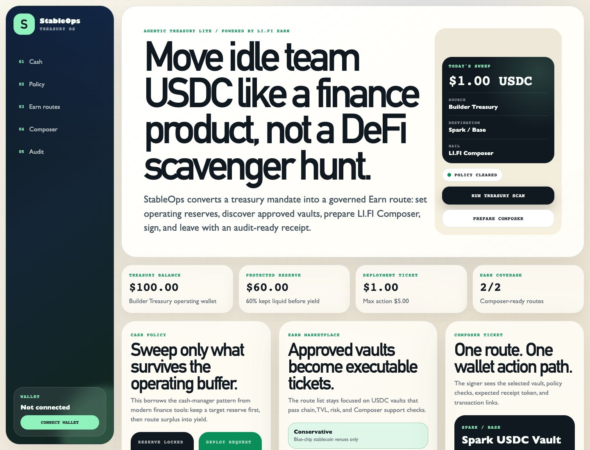
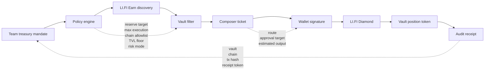
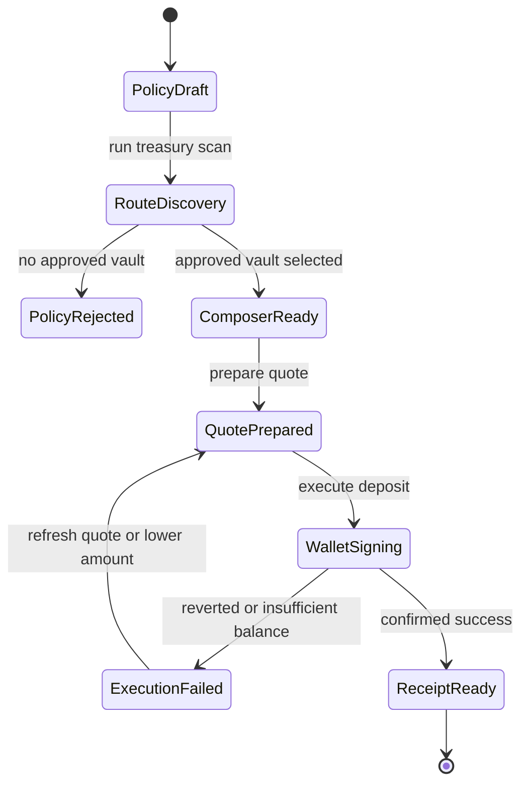

# StableOps Treasury


**Policy-first stablecoin treasury execution for small teams, DAOs, and indie builders.**

StableOps Treasury turns idle USDC into a governed LI.FI Earn execution flow:

```text
Treasury policy -> Earn route discovery -> policy checks -> Composer quote -> wallet execution -> audit receipt
```

Most yield products help users find APY. StableOps solves a different problem: **can a team treasury safely deploy this amount into this vault right now?**



## For Judges

| Item | Link / Proof |
|---|---|
| Live app | https://stableops-treasury.vercel.app |
| Demo video | Coming soon |
| Successful execution | https://basescan.org/tx/0x5bf01b31f161bf4ab0ad3b4c60d448469a66dda150cc6f02329a7dd188091e4b |
| Network | Base mainnet |
| LI.FI contract used | `LI.FI: LiFi Diamond` |
| Input token | `1 USDC` |
| Output position token | `0.939764550231504693 sparkUSDC` |
| Test coverage | `6/6` policy-engine tests |
| Track | AI x Earn |

## Live Demo

- App: https://stableops-treasury.vercel.app
- GitHub: https://github.com/richard7463/stableops-treasury
- Successful Base execution: https://basescan.org/tx/0x5bf01b31f161bf4ab0ad3b4c60d448469a66dda150cc6f02329a7dd188091e4b
- Track: **AI x Earn**

## What It Does

StableOps is not a personal wallet yield screen. It is a treasury operator that starts from rules, not APY.

Teams define:

- Treasury size
- Deploy amount
- Operating reserve target
- Maximum execution size
- Minimum vault TVL
- Allowed chains
- Risk mode

StableOps then discovers LI.FI Earn-compatible USDC vaults, filters them through the policy, creates a Composer execution ticket, and reports what happened after signing.

## Why It Matters

Small teams and DAOs often hold idle stablecoins, but treasury execution is operationally messy:

- Yield dashboards expose opportunities but do not enforce treasury policy.
- APY-first flows do not preserve operating reserves.
- Signers often cannot see why a route is allowed.
- Teams need a receipt explaining the vault, protocol, chain, transaction, and position token.

StableOps makes the flow legible for a real team wallet:

```text
Policy first. Route second. Signature last. Receipt always.
```

## Why Not Just A Yield Dashboard?

| Yield dashboard | StableOps Treasury |
|---|---|
| Shows APY first | Starts from treasury policy |
| Assumes the user decides risk manually | Enforces reserve, cap, TVL, chain, and risk checks |
| Optimizes for individual wallet yield | Optimizes for team treasury operations |
| Shows opportunities | Produces executable Composer tickets |
| Ends at transaction confirmation | Ends with an audit receipt and position-token explanation |
| Hides why a route was chosen | Shows agent decisions before signing |

## LI.FI Integration

StableOps uses LI.FI in two places:

- **LI.FI Earn discovery**: finds USDC vaults across supported chains.
- **LI.FI Composer quote**: prepares the executable deposit route from USDC into the selected vault token.

The execution path demonstrated on Base:

```text
USDC -> LI.FI Diamond -> Spark USDC Vault -> sparkUSDC receipt token
```

Confirmed transaction:

```text
Hash: 0x5bf01b31f161bf4ab0ad3b4c60d448469a66dda150cc6f02329a7dd188091e4b
Network: Base
Status: Success
Input: 1 USDC
Output: 0.939764550231504693 sparkUSDC
```

## Architecture



## Execution State Machine



## Product Flow

1. **Cash policy**  
   The team defines the treasury mandate: reserve target, deploy amount, max action size, TVL floor, chains, and risk mode.

2. **Earn marketplace**  
   StableOps loads USDC vaults and turns policy-approved opportunities into executable route cards.

3. **Composer ticket**  
   The signer sees the selected vault, protocol, chain, APY, TVL, expected receipt token, approval target, and policy checks.

4. **Wallet execution**  
   The app prepares and executes the LI.FI Composer deposit transaction through the connected wallet.

5. **Audit receipt**  
   StableOps reports the final vault, chain, transaction hash, and receipt token so the team can understand the position.

## Agent Layer

The AI layer is explicit and subordinate to policy:

- **Treasury Mandate** scopes deploy amount and reserve.
- **LI.FI Earn Scout** discovers executable vaults.
- **Risk Gate** filters by TVL, chain, and risk mode.
- **Policy Controller** blocks actions outside the mandate.
- **Composer Executor** prepares the quote.
- **Treasury Reporter** explains the final receipt token.

This is designed to be compatible with agentic-wallet workflows and skill-based execution environments.

## Demo Policy

```text
Treasury: Builder Treasury
Treasury size: 100 USDC
Deploy: 1 USDC
Reserve target: 60%
Max per execution: 5 USDC
Allowed chains: Base, Arbitrum
Risk mode: Conservative
Minimum TVL: $5,000,000
```

## Run Locally

```bash
npm install
cp .env.example .env.local
```

Add your LI.FI key:

```bash
LIFI_API_KEY=your_key_here
```

Start the app:

```bash
npm run dev
```

Open:

```text
http://localhost:3017
```

## Commands

```bash
npm run dev
npm run typecheck
npm run build
npm run start
npm run test
```

## Environment

```text
LIFI_API_KEY=
```

If the API key is not configured, the app can still show Composer-ready review routes locally. For production judging, configure `LIFI_API_KEY` so Earn discovery uses live LI.FI data.

## Skill

StableOps also includes a skill package for agentic-wallet style workflows:

```bash
clawhub install stableops-lifi-treasury
```

Published package:

```text
stableops-lifi-treasury@0.1.0
```

## Judge Notes

StableOps is built to align with the strongest hackathon patterns:

- **Working execution, not a mockup**: real Base transaction through LI.FI Diamond.
- **Clear product wedge**: team treasury execution, not generic yield discovery.
- **Policy-aware UX**: reserve, cap, TVL, chain, and risk checks before signing.
- **Agent legibility**: every agent decision is visible and auditable.
- **Composer-native flow**: the approved route becomes a wallet-executable deposit ticket.
- **Post-execution explanation**: the user sees what receipt token they now hold and why it matters.
- **Tested policy core**: reserve guardrail, execution cap, chain allowlist, TVL floor, and risk classification are covered by tests.

## License

MIT
