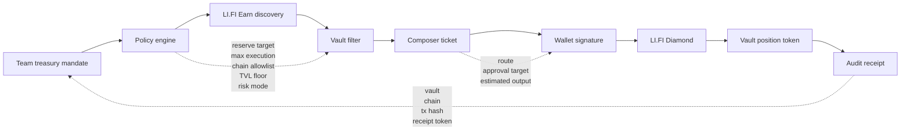
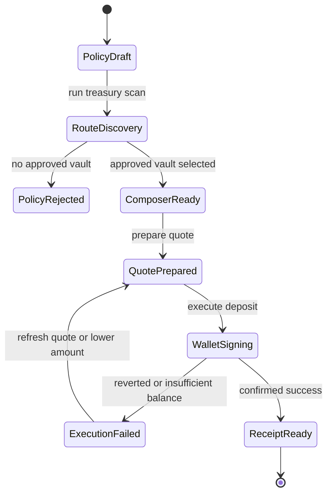

<p align="center">
  
</p>

# StableOps Treasury

## Governed USDC yield execution for team wallets


> **StableOps is a policy-first treasury executor that helps small teams, DAOs, and indie builders move idle USDC into LI.FI Earn vaults without turning treasury management into a DeFi scavenger hunt.**

Most yield products answer:

```text
Where is the highest APY?
```

StableOps answers:

```text
Can this team treasury safely deploy this amount into this vault right now?
```

That difference matters. A team wallet is not a personal wallet. A treasury action needs reserve protection, execution limits, chain scope, vault quality checks, signer visibility, and an audit receipt after execution.

StableOps turns that into one governed flow:

```text
Treasury policy -> LI.FI Earn discovery -> Policy checks -> Composer quote -> Wallet execution -> Audit receipt
```

## For Judges

| Item | Link / Proof |
|---|---|
| Live app | https://stableops-treasury.vercel.app |
| Demo video | Coming soon |
| Successful execution | https://basescan.org/tx/0x5bf01b31f161bf4ab0ad3b4c60d448469a66dda150cc6f02329a7dd188091e4b |
| Network | Base mainnet |
| LI.FI contract used | `LI.FI: LiFi Diamond` |
| Input token | `1 USDC` |
| Output position token | `0.939764550231504693 sparkUSDC` |
| Test coverage | `6/6` policy-engine tests |
| Track | AI x Earn |

## 30-Second Pitch

Small teams often hold idle USDC, but deploying that treasury into yield is still a manual operational process. Someone has to compare vaults, check chains, preserve working capital, review TVL, prepare approvals, sign the transaction, and explain the resulting position token to the rest of the team.

StableOps compresses that into a single treasury execution layer.

The team defines a mandate first: reserve target, deployment size, max action size, allowed chains, TVL floor, and risk mode. StableOps then uses LI.FI Earn to discover USDC vaults, filters them through the mandate, turns approved routes into LI.FI Composer tickets, executes through the connected wallet, and produces a receipt that explains what the treasury now holds.

The product is not trying to be another APY table. It is trying to be the missing workflow between **"we have idle stablecoins"** and **"this treasury action is approved, executed, and explainable."**

## Core Numbers

| Metric | Value |
|---|---|
| Demo treasury size | `100 USDC` |
| Protected operating reserve | `60%` |
| Demo deployment | `1 USDC` |
| Max action size | `5 USDC` |
| Minimum vault TVL | `$5,000,000` |
| Successful output | `0.939764550231504693 sparkUSDC` |
| Policy tests | `6 passing` |
| Execution chain | `Base mainnet` |

## Live Demo

- App: https://stableops-treasury.vercel.app
- GitHub: https://github.com/richard7463/stableops-treasury
- Successful Base execution: https://basescan.org/tx/0x5bf01b31f161bf4ab0ad3b4c60d448469a66dda150cc6f02329a7dd188091e4b
- Track: **AI x Earn**

## What It Does

StableOps is not a personal wallet yield screen. It is a treasury operator that starts from rules, not APY.

Teams define:

- Treasury size
- Deploy amount
- Operating reserve target
- Maximum execution size
- Minimum vault TVL
- Allowed chains
- Risk mode

StableOps then discovers LI.FI Earn-compatible USDC vaults, filters them through the policy, creates a Composer execution ticket, and reports what happened after signing.

## User Story

Imagine a small protocol team with stablecoins sitting idle in a team wallet.

They do not want an agent to freely chase yield. They also do not want to manually inspect every DeFi venue from scratch. What they need is a constrained operator:

```text
Keep 60% liquid.
Only deploy 1 USDC in this demo action.
Never exceed 5 USDC per execution.
Only use approved chains.
Only use vaults above the TVL floor.
Show the signer exactly what will happen before signing.
After execution, explain the receipt token.
```

StableOps makes that operating model visible in the product instead of burying it in a spreadsheet, chat thread, or off-chain policy doc.

## Why It Matters

Small teams and DAOs often hold idle stablecoins, but treasury execution is operationally messy:

- Yield dashboards expose opportunities but do not enforce treasury policy.
- APY-first flows do not preserve operating reserves.
- Signers often cannot see why a route is allowed.
- Teams need a receipt explaining the vault, protocol, chain, transaction, and position token.

StableOps makes the flow legible for a real team wallet:

```text
Policy first. Route second. Signature last. Receipt always.
```

## Why Not Just A Yield Dashboard?

| Yield dashboard | StableOps Treasury |
|---|---|
| Shows APY first | Starts from treasury policy |
| Assumes the user decides risk manually | Enforces reserve, cap, TVL, chain, and risk checks |
| Optimizes for individual wallet yield | Optimizes for team treasury operations |
| Shows opportunities | Produces executable Composer tickets |
| Ends at transaction confirmation | Ends with an audit receipt and position-token explanation |
| Hides why a route was chosen | Shows agent decisions before signing |

## What Makes It Agentic?

StableOps does not present the AI layer as magic. It decomposes the treasury action into explicit roles:

| Agent role | Responsibility | Output |
|---|---|---|
| Treasury Mandate | Scope deployment amount and reserve | Is this amount allowed? |
| LI.FI Earn Scout | Discover vault candidates | Which vaults are executable? |
| Risk Gate | Apply TVL, risk, and chain filters | Which routes are blocked? |
| Policy Controller | Enforce the treasury mandate | Can a Composer ticket be prepared? |
| Composer Executor | Prepare the executable route | What does the signer need to approve? |
| Treasury Reporter | Explain the final position | What did the treasury receive? |

The important design choice: **agents recommend and prepare, but policy gates execution and the wallet signs.**

## LI.FI Integration

StableOps uses LI.FI in two places:

- **LI.FI Earn discovery**: finds USDC vaults across supported chains.
- **LI.FI Composer quote**: prepares the executable deposit route from USDC into the selected vault token.

The execution path demonstrated on Base:

```text
USDC -> LI.FI Diamond -> Spark USDC Vault -> sparkUSDC receipt token
```

Confirmed transaction:

```text
Hash: 0x5bf01b31f161bf4ab0ad3b4c60d448469a66dda150cc6f02329a7dd188091e4b
Network: Base
Status: Success
Input: 1 USDC
Output: 0.939764550231504693 sparkUSDC
```

## Architecture



## Execution State Machine



## Product Flow

1. **Cash policy**  
   The team defines the treasury mandate: reserve target, deploy amount, max action size, TVL floor, chains, and risk mode.

2. **Earn marketplace**  
   StableOps loads USDC vaults and turns policy-approved opportunities into executable route cards.

3. **Composer ticket**  
   The signer sees the selected vault, protocol, chain, APY, TVL, expected receipt token, approval target, and policy checks.

4. **Wallet execution**  
   The app prepares and executes the LI.FI Composer deposit transaction through the connected wallet.

5. **Audit receipt**  
   StableOps reports the final vault, chain, transaction hash, and receipt token so the team can understand the position.

## Agent Layer

The AI layer is explicit and subordinate to policy:

- **Treasury Mandate** scopes deploy amount and reserve.
- **LI.FI Earn Scout** discovers executable vaults.
- **Risk Gate** filters by TVL, chain, and risk mode.
- **Policy Controller** blocks actions outside the mandate.
- **Composer Executor** prepares the quote.
- **Treasury Reporter** explains the final receipt token.

This is designed to be compatible with agentic-wallet workflows and skill-based execution environments.

## Demo Policy

```text
Treasury: Builder Treasury
Treasury size: 100 USDC
Deploy: 1 USDC
Reserve target: 60%
Max per execution: 5 USDC
Allowed chains: Base, Arbitrum
Risk mode: Conservative
Minimum TVL: $5,000,000
```

## Run Locally

```bash
npm install
cp .env.example .env.local
```

Add your LI.FI key:

```bash
LIFI_API_KEY=your_key_here
```

Start the app:

```bash
npm run dev
```

Open:

```text
http://localhost:3017
```

## Commands

```bash
npm run dev
npm run typecheck
npm run build
npm run start
npm run test
```

## Environment

```text
LIFI_API_KEY=
```

If the API key is not configured, the app can still show Composer-ready review routes locally. For production judging, configure `LIFI_API_KEY` so Earn discovery uses live LI.FI data.

## Skill

StableOps also includes a skill package for agentic-wallet style workflows:

```bash
clawhub install stableops-lifi-treasury
```

Published package:

```text
stableops-lifi-treasury@0.1.0
```

## Judge Notes

StableOps is built to align with the strongest hackathon patterns:

- **Working execution, not a mockup**: real Base transaction through LI.FI Diamond.
- **Clear product wedge**: team treasury execution, not generic yield discovery.
- **Policy-aware UX**: reserve, cap, TVL, chain, and risk checks before signing.
- **Agent legibility**: every agent decision is visible and auditable.
- **Composer-native flow**: the approved route becomes a wallet-executable deposit ticket.
- **Post-execution explanation**: the user sees what receipt token they now hold and why it matters.
- **Tested policy core**: reserve guardrail, execution cap, chain allowlist, TVL floor, and risk classification are covered by tests.

## License

MIT
